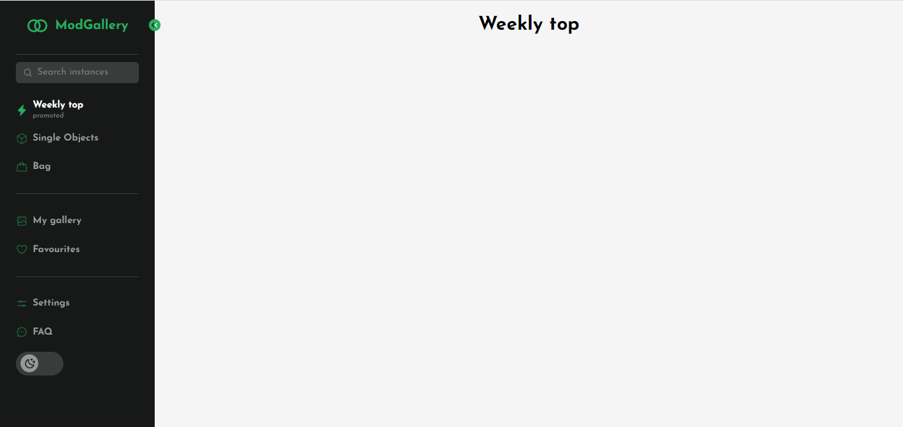

<div align="center">
  
  <h3>Sidebar com troca de tema</h3>
</div>

## 📃 Sobre

<br />

Menu lateral desenvolvido em react + typescript com troca de tema feito com styled-components.

## 💻 Principais Tecnologias utilizadas no projeto

Este projeto utiliza diversas tecnologias bem legais e úteis que você talvez possa gostar e utilizar em alguns projetos.

- [React](https://pt-br.reactjs.org/)
- [Vite](https://vitejs.dev/)
- [Typescript](https://www.typescriptlang.org/)
- [Styled-components](https://styled-components.com/)
- [React-router-dom](https://v5.reactrouter.com/web/guides/quick-start)
- [Phosphor-icons](https://phosphoricons.com/)

## Funcionalidades

Este projeto possui algumas funcionalidades bem legais em uma sidebar, como por exemplo:

- Link selecionado de acordo com a página.

- Abertura/Fechamento.

- Troca de tema.

## Como executar o projeto na sua máquina

<br />

Para executar o projeto você terá de seguir os passos listados abaixo. 

Primeiro clone o repositório do projeto com o comando:

<br />

```bash
git clone git@github.com:henrique998/ModGallery-Sidebar.git
```

Execute um dos comando abaixo para instalar as dependências do projeto:

```bash
npm install
# OU
yarn install
```

<br />

Agora está tudo pronto para iniciar o projeto. execute o comando abaixo para iniciar o servidor:

<br />

```bash
npm run dev
# OU
yarn dev
```

## Contato

<br />

Entre em contato comigo por email ou no linkedin:

- henriquemonteiro037@gmail.com
- [linkedin](https://www.linkedin.com/in/henrique-monteiro1/)